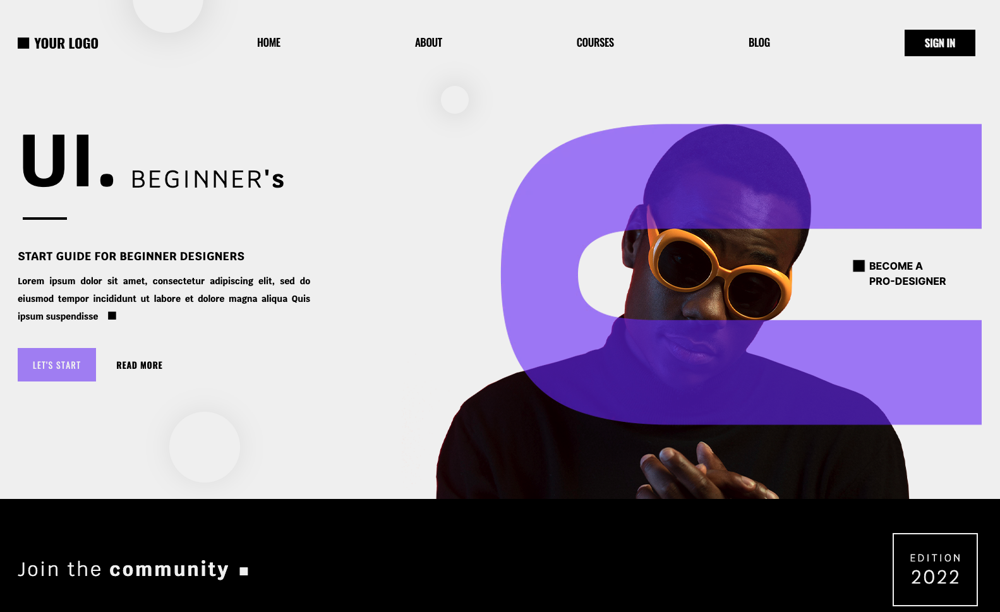
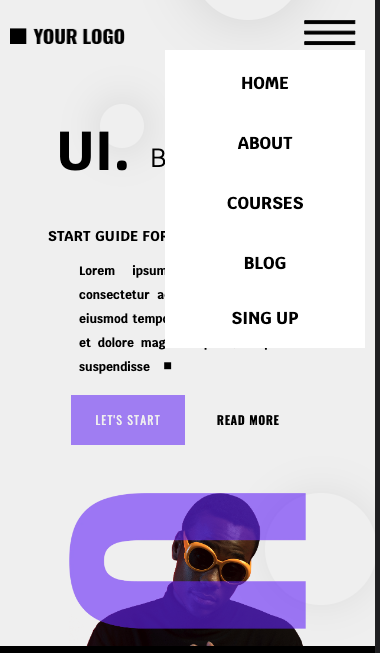
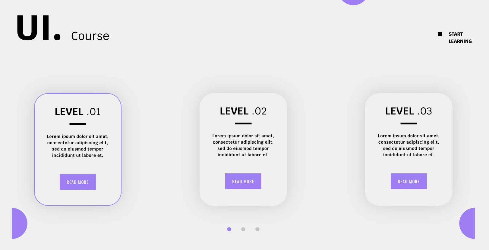
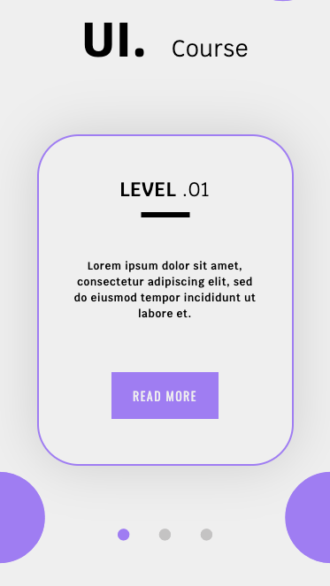
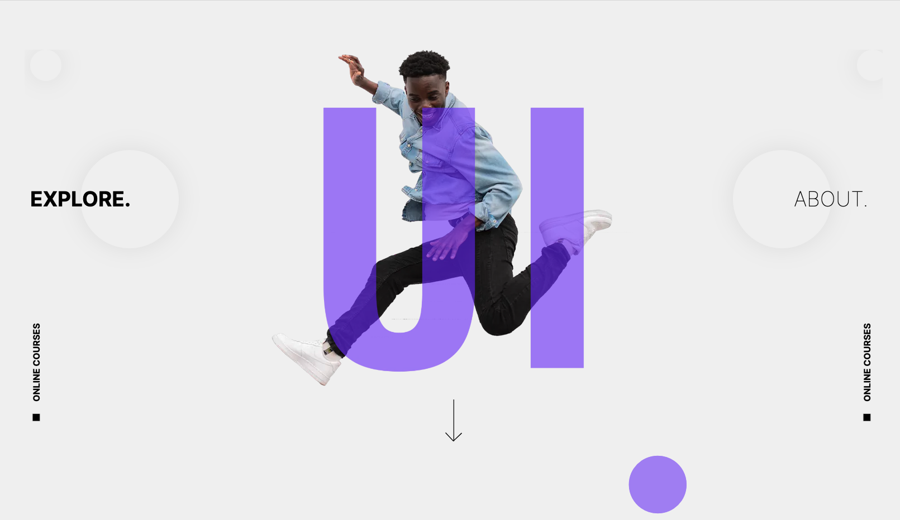
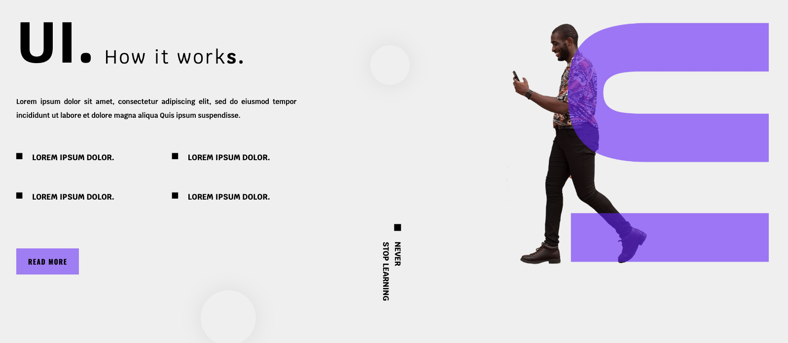
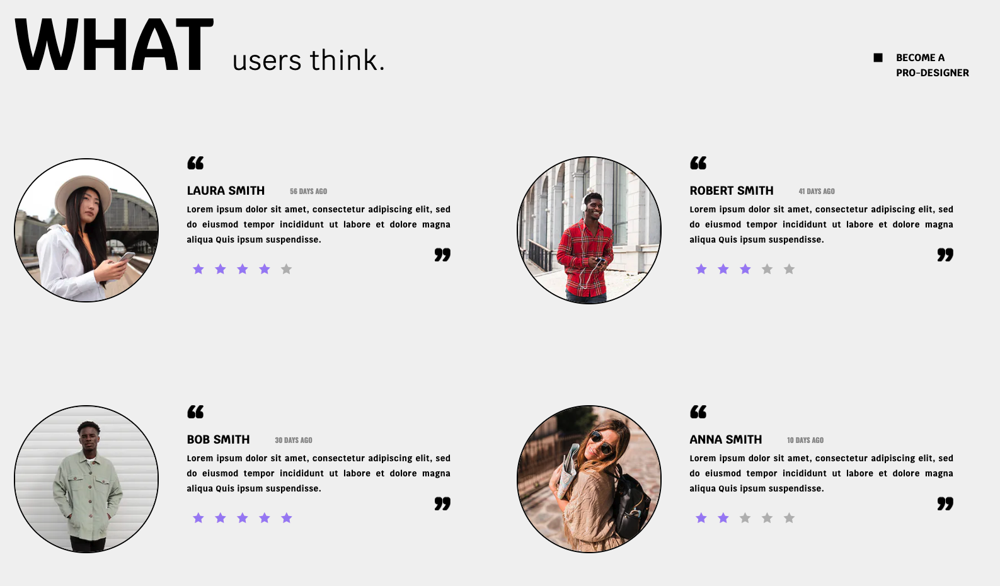

# SSG Next JS template

A site built in Next.js using Static Site Generation (SSG) and Tailwind CSS. Project based on template.

## [Live Demo](https://next-js-ssg-psi.vercel.app/)

## Technologies

- Next.js
- React
- Tailwind CSS

## Overview

Site template project utilizes Static Site Generation in NextJS. All styles implemented using Tailwind CSS. 

Features of the template include:
* Interactive buttons (they don't navigate)
* Arrow in Explore section that scrolls to next section
* Cards in Course Section that are connected with dots and change styles when Card is active

The deisign of the template is based [Freepik template](https://www.freepik.com/free-psd/user-interface-design-web-template_20548065.htm)

## Screenshots

### Top section
  
  &nbsp;  
### Mobile view top section + menu
  
  &nbsp;
### Course section
  
  &nbsp;
### Mobile view course section
  
  &nbsp;
### Explore section
  
  &nbsp;
### How it works section
  
  &nbsp;
### Users section
  
  &nbsp;
### Subscribe section
